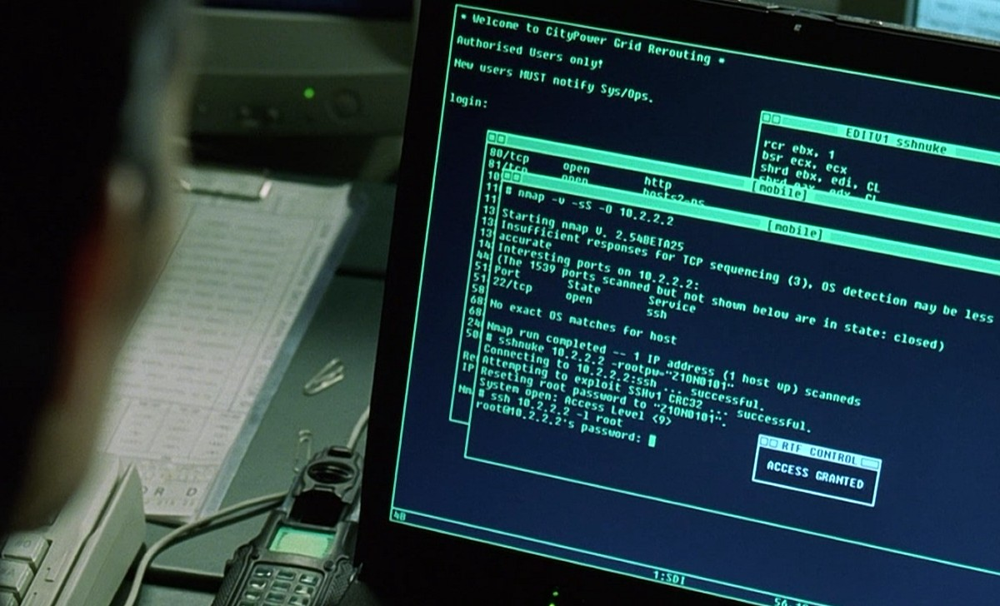

# Project preparation

During this project, you will use some tools and software that possibly you haven’t never used before. So I would suggest you start to learn them and get some basic experience before your project starts.

The tools I will mention below are not only important for your bachelor project, but also essential for your career in the coming decades. They are like “pen and paper” for programmers. You will use them everywhere you go. With this, I hope I have given you enough motivation. :rofl:

> [!Important]
> 1. Don’t try to learn everything right in the beginning. Learn them little by little with practices and patience.
> 2. Google is your friend. Whenever you don't know something, google it first.

Let’s start:

## 1. Unix operating system
Unix operating system is very different compared to Windows operating system from Microsoft. Nowadays, we have two major Unix systems: macOS (a.k.a OSX) and Linux. In some way, I think Unix system is easier for developers. One of the big reasons is it natively supports _Command Line Interface_. Have you ever seen a movie called “the Matrix”? If you have, you would find people in the movie use their computers in a very different way compared to normal people.
<p align="center">

</p>
Yes, they are using the Comand Line Interface (CLI) where everything is done by typing different commands in the terminal. By "everything", I mean EVERYTHING. You don't use mouse to click some bottons, but rather use keyboard to type commands to do things like: create a file, create a folder, navigate in the filesystem, open a file, edit a file or launch a program, etc. To do these, you will use different commands like: `cd`, `ls`, `mkdir`, `ssh`, `cp`, etc. You will use thise commands all the time and in the end, they will become your muscle memory whenever you use a Unix system.

### Install a Unix system
Almost everything you will do in your project will be done in Unix system. So it could be good idea you try one of them first. Since I assume you don't have a Mac, you should consider installing a Linux operating system in your laptop. Here is one thing you should be careful about. If you google "downloading Linux", you can't find an operating system called "Linux". But rather, Google suggests you download other operating systems, such as "Ubuntu", "Linux mint" or "Debian". Yes, they are all Linux systems, or more precisely, "Linux distros". And there are tons of Linux distros in the market. When you start your project, you will be assigned with a PC in our office. The operating system in the PC is called "Fedora". When you visit GSI in Darmstadt, they are using "Debian". Different distros have different "flavors". However, the basic commands in the CLI are same on whichever Linux distro you use.

Now comes the question about which one you should use and where you should install it. I would suggest you first try to install [Fedora](https://fedoraproject.org) on a virtual machine in Windows. (There are also many good Youtube videos to show you how to do that.) After that, when you are familiar with the installation process and some basic Unix commands, you could install it natively in your laptop along side your Windows. This is called [dual boot system](https://opensource.com/article/18/5/dual-boot-linux). Be **very careful** with that because if you don't, you could lose everything in your Windows.

## 2. Git & Github
Like I have said, Git is the greatest tool in the software community. Most of companies and collaborations (if not all) use git heavily on their projects. The reason is quite simple: Git is the best way how people collaborate and work on a project together. If you develop a software all alone, you may find git unnecessary. But whenever you need to work with other people or need to publish your software or algorithm, you have to know how to use Git. Normally you will create a Git repository for your project and then push the project to an online platform called "Github". Actually, the webpage you are looking at now is a Github webpage and the script you are reading is a Markdown file in a Git repository. Of course, there are many good Youtube videos to introduce some basic knowledge of Git and Github, like what is a repository, what is a commit, how to submit a commit and how to push/pull to/from Github. And please try to learn how to use Git in a Unix system with CLI.

## 3. C++
Now comes the big guy: C++. 95% of your code will be written in C++ and the rest 5% will be written in CMake (if needed). So you will spend a lot of time learning and practicing this programming language. For this, you have to be patient. Learn little by little along the way. To be honest, even though I have been using C++ for more than 4 years, I'm still learning this language on daily basis. I have to say **C++ is the hardest language to learn**. But if you could master C++ in the end, you could master all other languages instantly.

### How to learn C++
Learning a language starts from a "Hello world" program:

```cpp
#include <iostream>

auto main() -> int
{
    std::cout << "Hello world!\n";
    return 0;
}
```
So the first thing you could do is to try to compile and run this script in the terminal on your Linux system. Then you could start to search what's the meaning of all those keywords, like `#include`, `std::cout`. Later you could dig more, like trying to do same things in C++ as you did in Julia. You could find your Julia scripts you wrote during the lecture and try to rewrite it in C++ if possible. For now, I need to give you two major warnings when you learn C++ in the internet:

> [!Warning]
> 1. If someone says C/C++ or says you must learn C first before C++, stay away from them. C and C++ are completely different langauges and in many ways, learning C has a harmful impact on your C++ learning. Yes, you could write C in C++ code but this is a BAD BAD practice.
> 2. Learn Modern C++. In the internet, you could find a lot of source materials about C++. Not all of them are good. I would say most of them are bad. The reason is because most of them are either written in the last century or written by "the people from last century". 

30 years have been passed and lots of things have been changed in better ways. They become easier and safer to use. This [reddit post](https://www.reddit.com/r/cpp_questions/comments/rxx0z5/best_resources_to_learn_c/) summarizes which websites are good and which are bad. Youtube videos are also good source materials. The one I would suggest for the beginner level is [cherno](https://www.youtube.com/@TheCherno) and for the intermediate level is [Jason Turner](https://www.youtube.com/@cppweekly). They both have very nice short videos to introduce C++ piece by piece. Of course, the finest would be the [cppcon](https://www.youtube.com/@CppCon), which is for the high level.

### Build system for C++
For the first time you try to run a "hello world" program, you immediately have a question: how do I run this?

The most primitive way is to directly use compilers (gcc or clang):
```shell
gcc main.cpp -o main # compile
./main # run
```
This way is fine only for "Hello world". But once you are dealing with multiple files, folders and libraries, it becomes supper complicated. So the suggested way to do that is to use a build system called CMake. Here is a very good [Youtube video](https://www.youtube.com/watch?v=_yFPO1ofyF0&list=PLK6MXr8gasrGmIiSuVQXpfFuE1uPT615s&index=1&t=5s) how to run a C++ program using CMake.


### Programming text editor/IDE for C++
If you ask me which text editor or IDE is the best, I would say Vim/NeoVim without any hesitation. Actually this script is written using NeoVim:
<p align="center">

</p>
I still remember my programming teacher in Bonn once said: "If your are serious about programming, you must learn how to use Vim". And till now, I can't agree with more. The only problem about Vim is that it's supper unfriendly for beginners and has steep learning curve. Many people have this experience when they first use Vim in the terminal:
```shell
vim FileName.txt
```
and they don't know how to quit. This discourages a lot of people from using Vim. But from my experience talking to other vim users, we all agree on one thing: "Once you know how to use Vim, you can't go without it":smile:. Of course, there are also many beginner-friendly alternatives, like VsCode and Clion. You should have been already very familiar with these modern IDEs.
